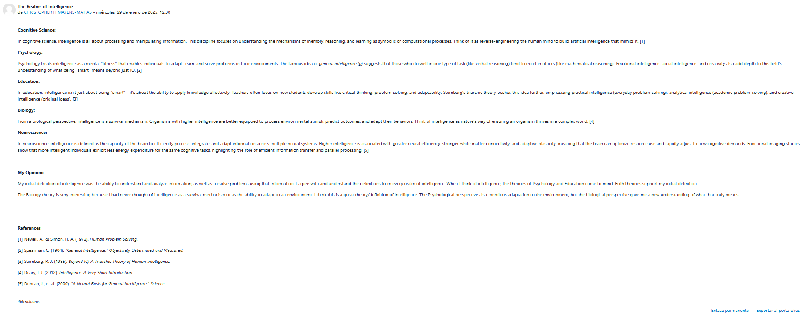
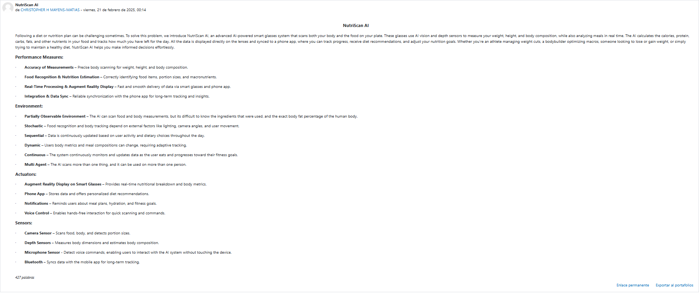
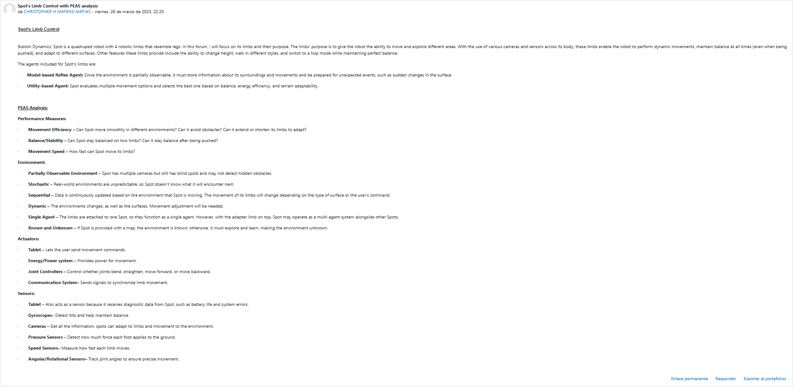

# 📝 Essays & Forums

## Essay 1 – Reading Assignment: 100 of Tech Revolution
- **Score:** 90/100 (90%)
- **Essay:** [View PDF](./essays/Recent%20Developments%20in%20Artificial%20Intelligence.pdf)

## Essay 2 – Is AI real intelligence that is Artificial?
- **Score:** 87.50/100 (87.50%)
- **Essay:** [View PDF](./essays/Mayens%20Matías%20Christopher%20H%20Essay%20on%20AI.pdf)

## Essay 3 – Bonus Assignment: Virtual Forum Summary
- **Score:** No grade provided
- **Essay:** [View PDF](./essays/Aspectos%20Éticos%20de%20la%20Inteligencia%20Artificial%20en%20la%20Educación%20Superior-Christopher%20H.%20Mayens.pdf)  
- **Certification:** [View PDF](./images/Certificado%20de%20Participación%20Foro%20IA.pdf)

---

## Forum 1 – Introductions
- **Score:** 100/100 (100%)

## Forum 2 – What is Your Personal Definition of Intelligence?
- **Score:** 100/100 (100%)

## Forum 3 – What is Intelligence?
- **Score:** 100/100 (100%)
- **Picture:**  
  

## Forum 4 – PEAS for Agents
- **Score:** 100/100 (100%)
- **Picture:**  
  

## Forum 5 – PEAS of Spot: Boston Dynamics’ Multipurpose Robot
- **Score:** 100/100 (100%)
- **Picture:**  
  

---

## AI and Society: Ethical Impact Analysis - Group Assignment (Part of the Final Exam)
- **Score:** 100/100 (100%)
- **Essay:** [View PDF](./essays/AI%20and%20Society_%20Ethical%20Impact%20Analysis.pdf)

---

## Reflection
- These activities helped me better understand the course material, as they required me to research and consider different perspectives from both AI experts and classmates. They also gave me the opportunity to practice concepts discussed in class, such as the PEAS analysis. The most valuable aspect was how they strengthened my critical thinking skills by encouraging me to analyze and compare diverse viewpoints. Additionally, I gained experience writing formal reports, which will be useful in future courses and professional environments.
